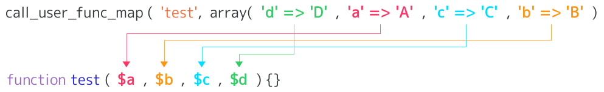
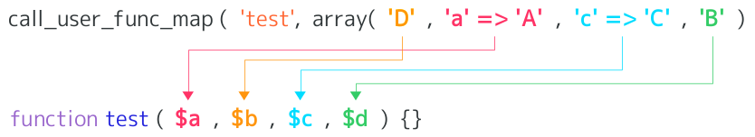
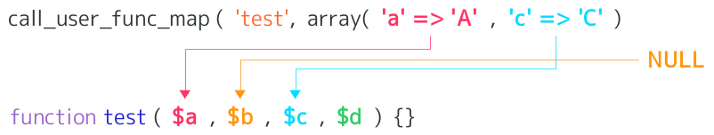
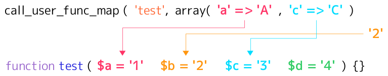

# Call a callback with an map of parameters function Extension for PHP

This extension allows call a callback with an map of parameters function.

## Build

    % phpize
    % ./configure
    % make
    $ make install

## Configration

callmap.ini:

    extension=callmap.so

    callmap.override_call_user_func_array=0      ; PHP_INI_SYSTEM
    callmap.override_forward_static_call_array=0 ; PHP_INI_SYSTEM

### callmap.override\_call\_user\_func\_array _bool_

Override to call\_user\_func\_map the call\_user\_func\_array function.

### callmap.override\_forward\_static\_call\_array _bool_

Override to forward\_static\_call\_map the forward\_static\_call\_array function.

## Function

* call\_user\_func\_map — Call a callback with an map of parameters
* forward\_static\_call\_map — Call a static method and pass the arguments as map

## call\_user\_func\_map — Call a callback with an map of parameters

### Description

mixed **call\_user\_func\_map** ( callable _$callback_ , array _$params_ )

Calls the callback given by the first parameter with the parameters in params.

### Parameters

* _callback_

  The callable to be called.

* _params_

  The parameters to be passed to the callback, as an indexed map.

### Return Values

Returns the return value of the callback, or FALSE on error.

## forward\_static\_call\_map — Call a static method and pass the arguments as map

### Description

mixed **forward\_static\_call\_map** ( callable _$callback_ , array _$params_ )

Calls a user defined function or method given by the function parameter.

### Parameters

* _callback_

  The callable to be called.

* _params_

  The parameters to be passed to the callback, as an indexed map.

### Return Values

Returns the return value of the callback, or FALSE on error.

## Examples

    function add($a, $b) {
        return $a + $b;
    }
    function sub($c, $d) {
        return $c - $d;
    }
    call_user_func_map('add', ['a' => 3, 'b' => 5, 'c' => 7, 'd' => 11]);
    // int(8)
    call_user_func_map('sub', ['a' => 3, 'b' => 5, 'c' => 7, 'd' => 11]);
    // int(-4)

### Example #1

    function test($a, $b, $c, $d) {
        //$a -- 'A'
        //$b -- 'B'
        //$c -- 'C'
        //$d -- 'D'
    }
    call_user_func_map('test', array('d' => 'D', 'a' => 'A', 'c' => 'C', 'b' => 'B'));

### Example #2

    function test($a, $b, $c, $d) {
        //$a -- 'A'
        //$b -- 'D'
        //$c -- 'C'
        //$d -- 'B'
    }
    call_user_func_map('test', array('D', 'a' => 'A', 'c' => 'C', 'B'));

### Example #3

    function test($a, $b, $c, $d) {
        //$a -- 'A'
        //$b -- NULL
        //$c -- 'C'
        //$d -- ?
    }
    call_user_func_map('test', array('a' => 'A', 'c' => 'C'));

### Example #4

    function test($a = '1', $b = '2', $c = '3', $d = '4') {
        //$a -- 'A'
        //$b -- '2' //version 0.2.0 or newer (0.1.0 is NULL)
        //$c -- 'C'
        //$d -- '4'
    }
    call_user_func_map('test', array('a' => 'A', 'c' => 'C'));

### Example #5

callmap.ini (callmap.override\_call\_user\_func\_array=1)

    var_dump(ini_get('callmap.override_call_user_func_array')); //bool(true)

    function test($a, $b) {
        return $a . $b;
    }
    $res1 = call_user_func_array('test', array('b' => '2', 'a' => '1'));
    $res2 = call_user_func_map('test', array('b' => '2', 'a' => '1'));

    var_dump($res1 === $res2); //bool(true)

## Related

* [code coverage report](http://gcov.at-ninja.jp.2-t.jp/D)
* [api document](http://api.at-ninja.jp.2-t.jp/E)
